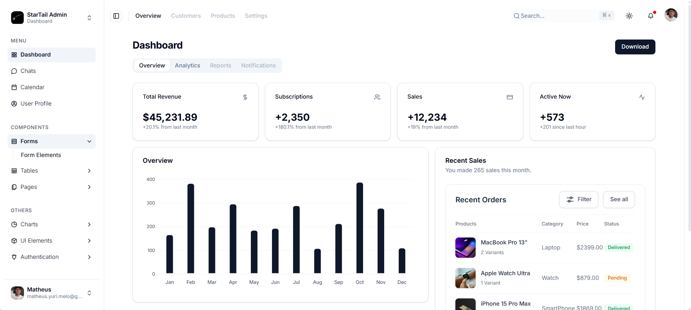
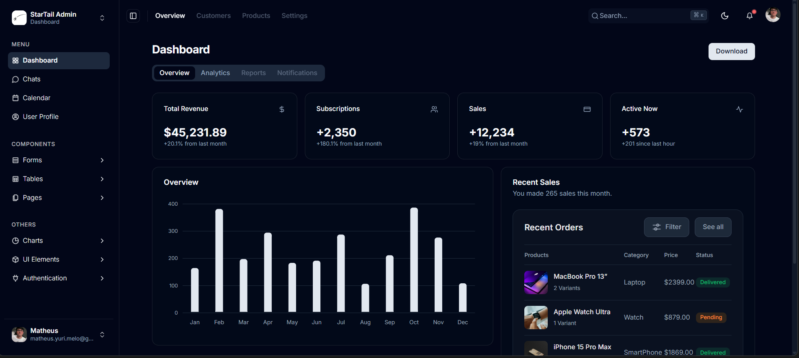

# StarTail Admin - Angular + Tailwind CSS Admin Dashboard

StarTail Admin is a free and open-source admin dashboard template built with **Angular 19** and **Tailwind CSS v4**, based on [shadcn-admin](https://github.com/satnaing/shadcn-admin). A port of the shadcn/ui admin design system to the Angular ecosystem, bringing the same clean aesthetic, semantic color tokens and component architecture to Angular developers.






## Tech Stack

- **Angular 19**
- **TypeScript**
- **Tailwind CSS v4**
- **ApexCharts**
- **Lucide Icons**
- **Flatpickr**

## Features

- Ecommerce Dashboard with metrics, charts and KPIs
- Sidebar navigation with collapsible groups and hover expand
- 5 chart types (Line, Bar, Pie, Donut, Area)
- Data tables with sorting and pagination
- Complete form elements (inputs, selects, checkboxes, radios, switches, date/time pickers, dropzone)
- Authentication pages (Sign In, Sign Up)
- User profile management
- Invoice system with creation and preview
- Chat interface
- Calendar page
- Error pages (401, 403, 404, 500, 503)
- Dark and Light mode with automatic persistence
- RTL support
- Fully responsive

## UI Components

- Alert
- Avatar
- Badge
- Button
- Card
- Dropdown
- Icon (100+ icons)
- Modal
- Pagination
- Search Input
- Table
- Input Field
- Checkbox
- Radio
- Switch
- Select
- Multi Select
- Text Area
- File Input
- Date Picker
- Time Picker

## Pages

| Page | Route |
|------|-------|
| Dashboard | `/` |
| Chats | `/chats` |
| Calendar | `/calendar` |
| User Profile | `/profile` |
| Form Elements | `/form-elements` |
| Basic Tables | `/basic-tables` |
| Line Chart | `/line-chart` |
| Bar Chart | `/bar-chart` |
| Pie Chart | `/pie-chart` |
| Donut Chart | `/donut-chart` |
| Area Chart | `/area-chart` |
| Alerts | `/alerts` |
| Avatars | `/avatars` |
| Badges | `/badge` |
| Buttons | `/buttons` |
| Images | `/images` |
| Videos | `/videos` |
| Sign In | `/signin` |
| Sign Up | `/signup` |
| 401 | `/401` |
| 403 | `/403` |
| 404 | `/404` |
| 500 | `/500` |
| 503 | `/503` |
| Blank Page | `/blank` |

## Installation

Prerequisites: **Node.js 18+** and **Angular CLI**.

```bash
git clone https://github.com/mathsukamura/startail-admin.git
cd startail-admin
npm install
ng serve
```

Open `http://localhost:4200`

## Project Structure

```
src/
  app/
    pages/              # Route pages
      dashboard/        # Ecommerce dashboard
      chats/            # Chat interface
      calender/         # Calendar
      profile/          # User profile
      charts/           # Line, Bar, Pie, Donut, Area
      tables/           # Basic tables
      forms/            # Form elements
      ui-elements/      # Alerts, Badges, Buttons, etc.
      auth-pages/       # Sign In, Sign Up
      errors/           # 401, 403, 404, 500, 503
      invoices/         # Invoice management
    shared/
      components/
        ui/             # Base UI components
        form/           # Form components
        common/         # Shared components
        ecommerce/      # Dashboard widgets
      layout/           # Sidebar, Header, App shell
      services/         # Theme, Sidebar, Charts
```

## License

MIT License - Copyright (c) 2026 Matheus Yuri de Melo Barros. See [LICENSE](./LICENSE) for details.
